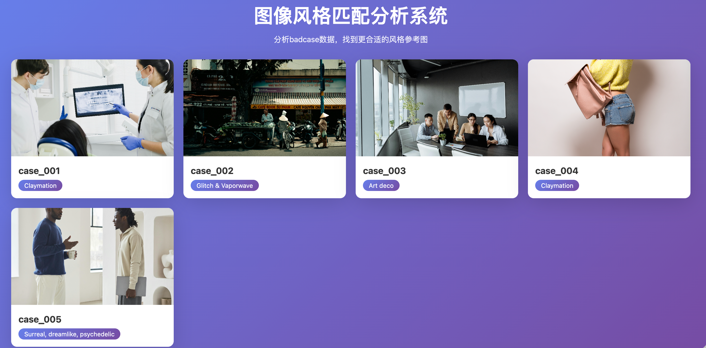
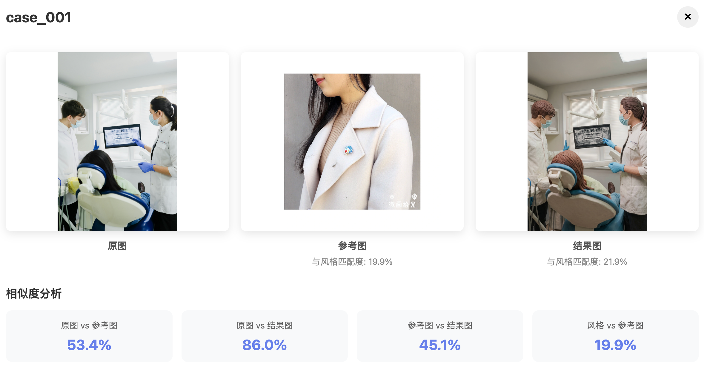

# 以图搜图 · 图像风格分析

一个面向本地数据集的图像检索与风格分析服务。项目结合 CLIP 向量检索、图像描述与可选的云端图片搜索，帮助你从一组参考图中找到更贴近目标风格的结果。

> 这是一个本地优先的 Flask 应用：数据、向量化任务和云服务凭据均由部署者管理。

## 产品演示





## 业务价值

- **提升参考图筛选效率**：把人工翻图库、看风格、做对比的过程转成可量化的相似度分析，适合设计、电商、广告和内容生产场景。
- **沉淀 badcase 分析方法**：每个 case 同时展示原图、参考图、结果图和多组相似度指标，方便复盘生成效果为什么偏离目标风格。
- **辅助创意决策**：通过 CLIP 图文特征和可选的图片描述能力，把“像不像”“风格是否接近”变成更容易讨论和迭代的依据。
- **兼容本地与云端素材流**：既能处理本地数据集，也能接入 OSS 与网络图片搜索，适合从离线实验逐步扩展到真实业务流程。
- **降低集成成本**：提供轻量 Web 页面和 JSON API，可以作为内部工具、评测面板或上游生成系统的分析组件。

## 技术要点

- **多模态向量检索**：使用 CLIP 同时编码图片与文本，将视觉内容、风格词和描述词放到统一向量空间中比较。
- **分层相似度分析**：支持原图 vs 参考图、原图 vs 结果图、参考图 vs 结果图、风格词 vs 图片等多维度指标。
- **本地优先架构**：核心分析可在本地样例数据上运行，云服务均为可选能力，便于私有数据和实验环境使用。
- **可扩展数据管线**：脚本覆盖初始化、批量向量化、Parquet 处理、OSS 同步和 badcase 处理，方便替换自己的数据源。
- **服务化接口**：Flask API 封装 case 列表、单 case 分析、参考图查找、图片代理和静态资源访问，便于前端或其他系统调用。
- **开源安全边界**：所有真实密钥从环境变量读取，README 明确提示 `.env`、本地缓存、向量数据库和私有素材不应提交。

## 能做什么

- 用 **CLIP** 提取图片与文本特征，计算风格相似度
- 分析 badcase，给出参考图推荐与相似度结果
- 可选接入 **腾讯云图像搜索**，补充网络图片候选
- 可选接入 **阿里云 OSS**，读取、上传和生成带时效的访问链接
- 可选接入 **豆包 API**，生成图片描述、关键词与参考图提示词
- 提供一个轻量 Web 页面和 JSON API，方便本地调试与集成

## CLIP 在这里做什么

CLIP（Contrastive Language-Image Pre-training）是 OpenAI 提出的图文联合表征模型。它把图片和文本映射到同一个向量空间：语义、构图或风格相近的图片与描述，会得到距离更近的向量。

在本项目中，CLIP 主要承担三件事：

- **图片向量化**：将本地图片编码成高维特征，用于后续相似度检索。
- **文本辅助匹配**：将风格词、描述词或搜索词编码成文本向量，与图片向量进行比较。
- **风格相似度排序**：结合图片特征和文本特征，为 badcase 推荐更接近目标风格的参考图。

默认模型由 `CLIP_MODEL` 环境变量控制，例如 `ViT-B/32`。首次运行时模型会自动下载；如果数据量较大，建议使用 GPU 来加速批量向量化。

## 架构概览

```text
图片 / Parquet / OSS
        │
        ▼
CLIP 特征提取 ──► 向量与元数据存储 ──► StyleMatcher
                                          │
                         腾讯云搜索 / 豆包描述（可选）
                                          │
                                          ▼
                                  Flask API 与 Web 页面
```

## 快速开始

### 1. 准备环境

- Python 3.8+
- 推荐使用带 CUDA 的 PyTorch 环境；CPU 也可以运行，但首次模型加载和批处理会更慢
- 可选：PostgreSQL（用于持久化向量与元数据）、腾讯云、阿里云 OSS、豆包 API

```bash
git clone <your-repository-url>
cd yitusoutu

python -m venv .venv
source .venv/bin/activate  # Windows: .venv\Scripts\activate
pip install -r requirements.txt
```

### 2. 配置本地环境变量

在仓库根目录创建 `.env`。它只应保留在本机，**绝不要提交、粘贴到 Issue，或写入测试脚本**。

```env
# 服务
DEBUG=False
SECRET_KEY=replace-with-a-long-random-value
PORT=5000

# 本地数据
DATA_DIR=/absolute/path/to/badcases
PARQUET_FILE=/absolute/path/to/images.parquet
CLIP_MODEL=ViT-B/32

# PostgreSQL（可选）
DB_NAME=image_search
DB_USER=postgres
DB_PASSWORD=
DB_HOST=localhost
DB_PORT=5432

# 腾讯云图像搜索（可选）
USE_TENCENT_SEARCH=False
TENCENT_SECRET_ID=
TENCENT_SECRET_KEY=

# 阿里云 OSS（可选）
ALIYUN_OSS_ACCESS_KEY_ID=
ALIYUN_OSS_ACCESS_KEY_SECRET=
ALIYUN_OSS_ENDPOINT=oss-cn-hangzhou.aliyuncs.com
ALIYUN_OSS_BUCKET=

# 豆包 API（可选）
DOUBAO_API_KEY=
DOUBAO_MODEL_ID=doubao-seed-2-0-lite-260428
```

### 3. 启动服务

```bash
python -m src.app
```

默认访问地址为 [http://localhost:5000](http://localhost:5000)。首次运行可能需要下载 CLIP 模型。

## API 一览

| 方法 | 路径 | 说明 |
| --- | --- | --- |
| `GET` | `/api/cases` | 获取可分析的 case 列表 |
| `GET` | `/api/cases/<case_name>/info` | 获取 case 的图片与风格信息 |
| `GET` | `/api/analyze` | 分析所有 case |
| `GET` | `/api/analyze/<case_name>` | 分析单个 case；可附加 `?refresh=true` |
| `POST` | `/api/refresh_network/<case_name>` | 刷新网络搜索结果 |
| `POST` | `/api/refresh_generated/<case_name>` | 刷新生成图结果 |
| `POST` | `/api/find_reference` | 为指定图片寻找参考图 |
| `GET` | `/image/<case_name>/<filename>` | 读取 case 中的本地图片 |
| `GET` | `/generated_images/<path>` | 读取生成图片 |
| `GET` | `/oss/<path>` | 重定向到 OSS 图片的访问链接 |
| `GET` | `/proxy/image?url=<https-url>` | 代理读取远程图片 |

示例：分析一个 case。

```bash
curl "http://localhost:5000/api/analyze/case_001?refresh=false"
```

示例：按结果图或原图寻找参考图。

```bash
curl -X POST http://localhost:5000/api/find_reference \
  -H 'Content-Type: application/json' \
  -d '{
    "image_path": "/absolute/path/to/image.jpg",
    "style": "新中式 插画",
    "top_k": 5,
    "by_result": true
  }'
```

## 常用脚本

| 脚本 | 用途 |
| --- | --- |
| `scripts/init_db.py` | 初始化数据库表结构 |
| `scripts/quick_vectorize.py` | 快速为数据集生成向量 |
| `scripts/vectorize_parquet.py` | 从 Parquet 批量处理图片与文本特征 |
| `scripts/update_vectors_from_oss.py` | 从 OSS 拉取图片并更新向量 |
| `scripts/process_badcase.py` | 处理单批 badcase 数据 |
| `scripts/batch_vectorize_fast.py` | 并发批处理向量化任务 |

各脚本使用的本地路径、数据库与云服务配置都来自环境变量；运行前请先检查 `.env`。

## 项目结构

```text
.
├── src/
│   ├── app.py                  # Flask 路由与服务入口
│   ├── style_matcher.py        # 风格匹配与 badcase 分析
│   ├── feature_extractor.py    # CLIP 特征提取
│   ├── vector_db.py            # 向量检索与数据库操作
│   ├── aliyun_oss.py           # OSS 封装
│   ├── tencent_image_search.py # 腾讯云图片搜索封装
│   └── image_captioner.py      # 图像描述与生成提示词
├── scripts/                    # 初始化、向量化与数据处理工具
├── static/                     # Web 页面
├── config.py                   # 环境变量配置入口
└── requirements.txt            # Python 依赖
```

## 测试与检查

```bash
python test_system.py
python test_api.py
```

需要云服务的测试会读取本地环境变量。请使用最小权限、可轮换的测试凭据；不要在源码中硬编码任何密钥。

## 开源前安全清单

- 确认 `.env`、数据集、缓存、向量数据库和本地 IDE 文件均未被 Git 跟踪
- 所有云端凭据仅从环境变量或密钥管理服务读取
- 已泄露或曾被提交过的密钥必须先在云控制台**禁用并轮换**；仅删除文件中的文本并不能清除 Git 历史
- 为 OSS、腾讯云与豆包凭据授予最小权限，并设置配额、告警与过期策略
- 在公开部署前为 API 加上认证、访问控制与网络边界

## 许可证

MIT License
